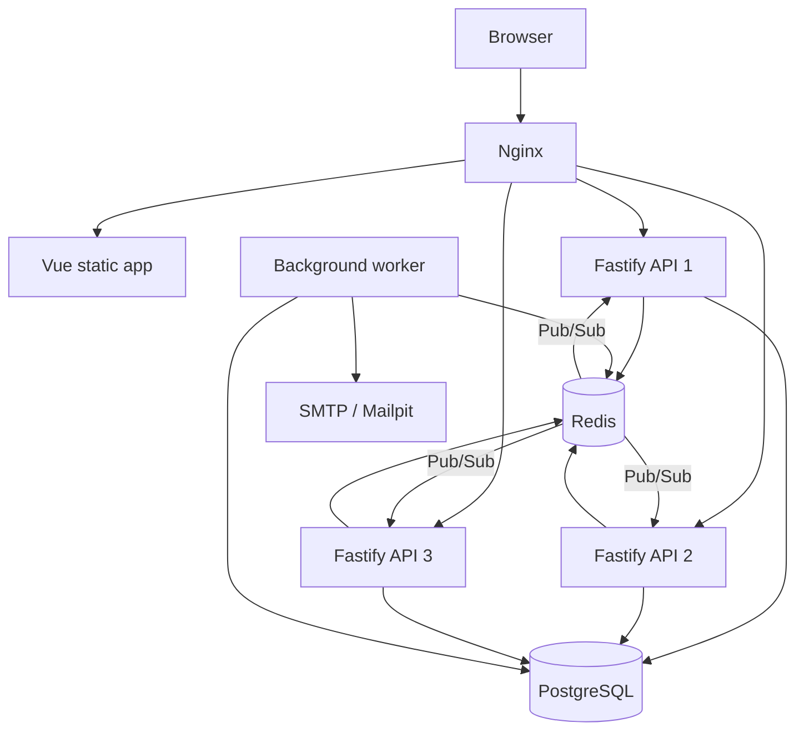
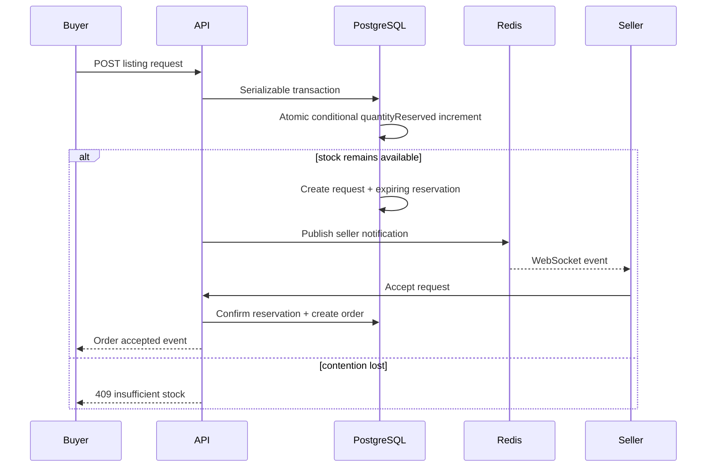
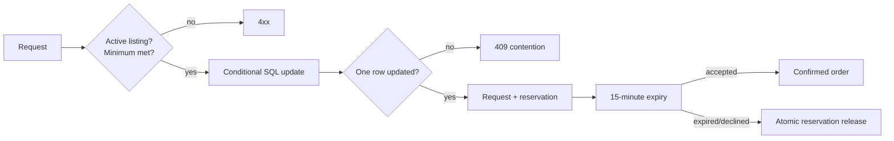
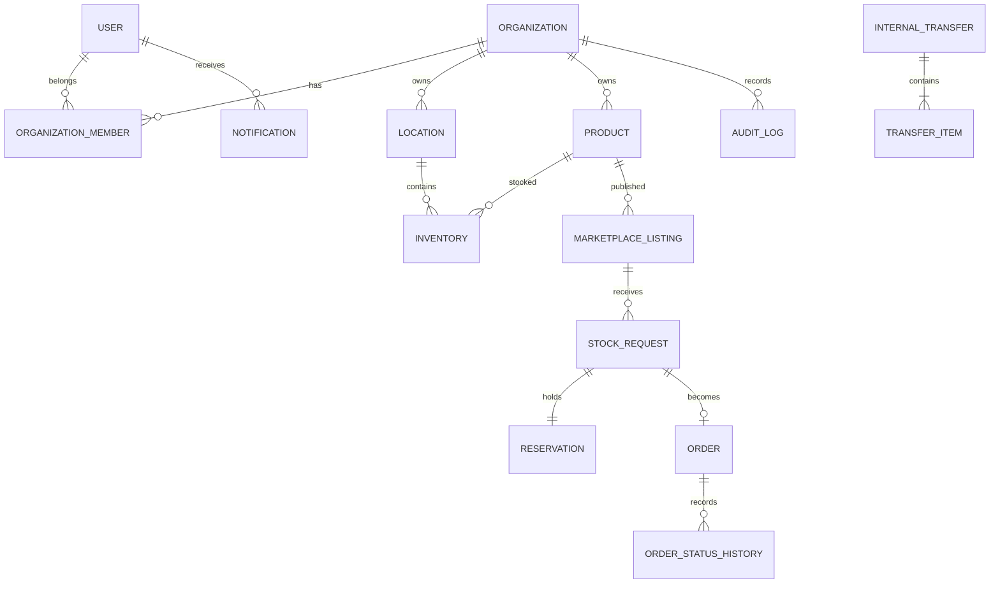

# ReStockr

**Same Stock. A Brighter Tomorrow.**


ReStockr is a multi-company inventory network. It helps an organization detect stock risk, rebalance inventory between its own locations, and publish only explicitly allocated surplus to a private B2B marketplace.

This repository is a production-oriented modular-monolith foundation: one stateless Fastify API, one Vue application, PostgreSQL as the business source of truth, Redis for ephemeral coordination, a worker, and Nginx in front of three API replicas.

## What is implemented

- Registration, login, logout, refresh rotation, current user, password change, and password-reset tokens.
- Server-side RBAC and organization-scoped queries.
- Locations, products, inventory adjustments, movement history, stock-health classification, and internal transfer recommendations.
- Internal transfers with inventory reservation and validated lifecycle transitions.
- Marketplace listings that reserve only the quantity explicitly published.
- Atomic B2B reservation, expiration worker, accept/decline flow, orders, and validated order transitions.
- In-app notifications and cross-instance WebSocket delivery through Redis Pub/Sub.
- Live dashboard and advanced analytics with background aggregation and Redis caching.
- Organization settings, role-based member management, and a public company network.
- Product detail pages, inventory movement charts, order timelines, and listing management.
- Durable SMTP email jobs for password recovery and member onboarding.
- Idempotent critical reservations using PostgreSQL advisory locks and persisted responses.
- Prometheus runtime/HTTP metrics and request/trace correlation IDs.
- PostgreSQL constraints preventing negative/reserved-over-on-hand inventory.
- Responsive Vue UI for auth, analytics, inventory CRUD, marketplace, companies, requests, orders, transfers, and settings.
- Nginx load balancing, three API containers, worker, health checks, graceful shutdown, seed data, unit tests, database concurrency test, and k6 scenarios.

The project does not pretend to include an ML model. Stock health and rebalancing are deterministic and explainable. Development email is delivered through SMTP to Mailpit; production can use any SMTP provider through environment configuration. Payment, shipping-carrier integration, and organization billing are deliberately outside this foundation.

## Architecture



The API is stateless. Access tokens contain the active organization and role; every protected query still scopes by `organizationId`. Redis loss can reduce caching, rate limiting, and real-time delivery, but PostgreSQL constraints and atomic mutations continue to protect stock correctness.

### Domain boundaries

The API is organized by business domain under `apps/api/src/modules`. Routes validate transport input and delegate business rules to focused functions or transactions. Shared deterministic policies—stock health, permissions, and state transitions—are independent and unit-tested.

Prisma was chosen over Drizzle because the schema has many relations, stateful workflows, and transaction-heavy mutations. Prisma gives readable relational modeling, generated strict types, and a mature migration workflow. Raw SQL remains available when a database-native operation is clearer.

## Data flow

### B2B request



### Reservation invariant



Correctness comes from PostgreSQL, not a Redis lock: the conditional row update is atomic across every replica, the transaction is serializable, and check constraints reject invalid persisted states. Redis coordinates cache, rate limits, jobs, and cross-instance events.

### Entity overview



## Repository layout

```text
apps/web                 Vue 3 + Vite + Pinia client
apps/api                 Fastify API, worker, Prisma schema, tests
packages/shared          Framework-neutral shared contracts/policies
infrastructure/nginx     Gateway and SPA server configuration
tests/load               k6 mixed-load and contention scenarios
docker-compose.yml       Web, Nginx, 3 APIs, worker, PostgreSQL, Redis, Mailpit
```

## Local setup

Requirements: Node.js 22+, npm 11+, PostgreSQL 17+, Redis 7+, and optionally Docker Desktop and k6.

```bash
cp .env.example .env
npm install
npm run db:generate
npm run db:migrate
npm run db:seed
npm run dev
```

On PowerShell use `Copy-Item .env.example .env`. Update the local `DATABASE_URL` and `REDIS_URL` when running outside Compose. The generated demo accounts are:

- `owner@nova-retail.demo`
- `owner@techsource.demo`
- `owner@officehub.demo`
- Password: `Demo1234` (development seed only)

The seed is idempotent and creates low, healthy, surplus, marketplace, and internal-rebalancing examples.

## Docker

```bash
docker compose build
docker compose run --rm api-1 npx prisma migrate deploy --schema apps/api/prisma/schema.prisma
docker compose run --rm api-1 npx tsx apps/api/prisma/seed.ts
docker compose up -d
```

Open `http://localhost:8081` (or the configured `WEB_PORT`). Mailpit is available at `http://localhost:8026`. PostgreSQL and Redis stay inside the Compose network. Replace all development defaults before any shared deployment.

Nginx uses `least_conn`, passive failure detection, proxy timeouts, forwarded request IDs, and WebSocket upgrade headers. No sticky sessions are used. When `EXPOSE_INSTANCE_ID=true` outside production, repeated responses contain `X-ReStockr-Instance` so load distribution can be verified:

```bash
for i in {1..12}; do curl -sI http://localhost:8080/health | grep X-ReStockr-Instance; done
```

## API overview

All business routes are under `/api/v1`.

| Area | Important endpoints |
|---|---|
| Auth | `POST /auth/register`, `/login`, `/refresh`, `/logout`, `/forgot-password`, `/reset-password`, `GET /auth/me` |
| Products | `GET/POST /products`, `GET/PATCH/DELETE /products/:id` |
| Inventory | `GET /inventory`, `POST /inventory/adjust`, `GET /inventory/recommendations`, `GET /inventory/:productId/movements` |
| Marketplace | `GET/POST /marketplace/listings`, `GET /marketplace/my-listings`, `PATCH /marketplace/listings/:id`, `POST /marketplace/listings/:id/requests` |
| Requests | `GET /requests/incoming`, `/outgoing`, `POST /requests/:id/accept`, `/decline` |
| Orders | `GET /orders`, `GET /orders/:id`, `POST /orders/:id/status` |
| Transfers | `GET/POST /transfers`, `POST /transfers/:id/status` |
| Notifications | `GET /notifications`, `POST /notifications/:id/read`, `WS /realtime` |
| Organization | `GET/PATCH /organization`, CRUD-style member management under `/organization/members` |
| Network | `GET /network` |
| Operations | `GET /dashboard/summary`, `/analytics`, `/metrics`, `/health/live`, `/health/ready` |

Successful responses use `{ "data": ... }`; list endpoints add `meta`. Errors use `{ "error": { "code", "message", "requestId", "details?" } }` and never expose production stack traces.

## Security decisions

- Argon2 password hashing and generic forgot-password responses.
- Short-lived JWT access tokens plus opaque, hashed, rotating refresh tokens with revocation.
- Reset tokens are random, hashed at rest, single-use, short-lived, and revoke existing sessions.
- RBAC is enforced inside API routes; UI visibility is not an authorization boundary.
- Private inventory queries always require the authenticated organization ID.
- Marketplace responses expose listing allocation, never total private stock.
- Zod validates body, params, query, and relevant headers.
- Helmet, explicit CORS, 1 MB body limit, Redis-backed auth rate limiting, log redaction, and safe errors.
- Money uses PostgreSQL `NUMERIC`, never floating-point columns.
- Database check constraints enforce non-negative quantities and valid monetary values.

For a stronger defense-in-depth production deployment, add PostgreSQL Row Level Security using a transaction-local tenant setting. Application scoping remains necessary for clear authorization and tests.

## Caching and real-time

| Data | Key | TTL/invalidation |
|---|---|---|
| Dashboard | `restockr:dashboard:{organizationId}` | 60s; deleted after stock/transfer mutation |
| Marketplace search | `restockr:marketplace:search:{version}:{queryHash}` | 30s; global version increment after reservation/listing mutation |
| Analytics | `restockr:analytics:{organizationId}` | Refreshed every minute by the background worker |
| Organization events | `restockr:organization:{organizationId}` | Pub/Sub; never a durable record |

Notifications are persisted before or alongside events. Redis Pub/Sub only accelerates delivery; reconnecting clients reload durable notifications from PostgreSQL.

## Tests and verification

```bash
npm run typecheck
npm test
npm run build
```

The database concurrency test is intentionally not mocked. Point it at a migrated disposable database:

```bash
TEST_DATABASE_URL=postgresql://... npm test --workspace @restockr/api
```

It issues 100 simultaneous atomic reservations of 10 units against a 100-unit listing. Exactly 10 may win; the persisted remaining quantity must never be negative.

### Load tests

```bash
k6 run -e BASE_URL=http://localhost:8080 -e ACCESS_TOKEN=... tests/load/restockr.js
k6 run -e BASE_URL=http://localhost:8080 -e ACCESS_TOKEN=... -e LISTING_ID=... -e DESTINATION_LOCATION_ID=... tests/load/reservation-race.js
```

The mixed workload includes smoke, 50-user normal load, and a 200-user spike. The initial goal is p95 below 500 ms and less than 1% error rate for valid non-contention requests. No benchmark numbers are recorded until those scripts run on a documented machine.

## Failure behavior

- **One API stops:** Nginx passively removes it after failures; other replicas remain valid because no process owns session state.
- **Redis unavailable:** readiness fails and cache/realtime/rate-limit features degrade visibly; PostgreSQL constraints still prevent overselling.
- **PostgreSQL unavailable:** readiness returns 503 and mutations fail; Redis is never used as inventory truth.
- **Reservation expires:** the worker claims active rows transactionally, releases listing quantity once, and marks the request expired.
- **Duplicate/racing buyers:** a conditional atomic update permits only remaining stock.
- **WebSocket disconnects:** the client reconnects and reloads durable notifications.
- **Shutdown:** SIGTERM/SIGINT closes HTTP, PostgreSQL, Redis, and worker connections.

## Deployment notes

Build immutable images, run migrations as a one-off release job before starting new API replicas, use managed PostgreSQL/Redis with backups and encryption, store secrets in the platform secret manager, terminate TLS at the edge, and ship structured logs to a central backend. Add metrics for reservation conflicts, expiry lag, database pool saturation, Redis latency, request p95/p99, WebSocket connections, and worker failures.

The audit log is append-only at application level. Regulated environments should additionally revoke `UPDATE/DELETE` privileges on that table for the runtime database role and archive logs to immutable storage.
